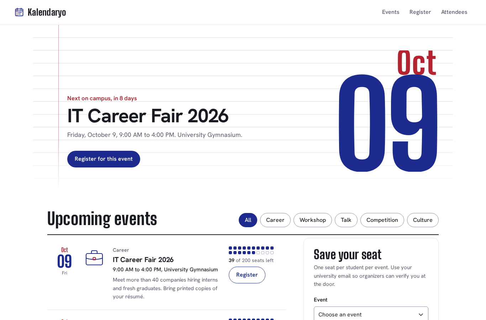
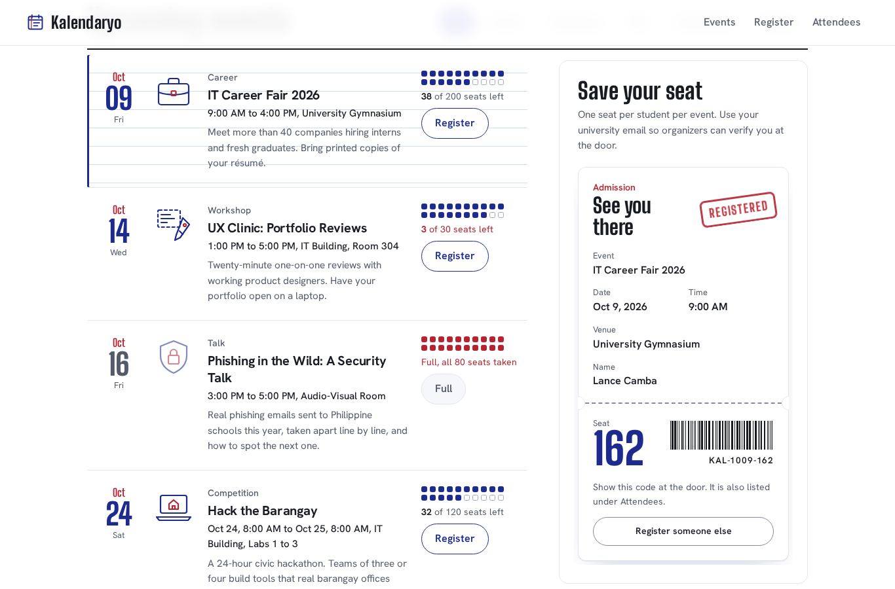
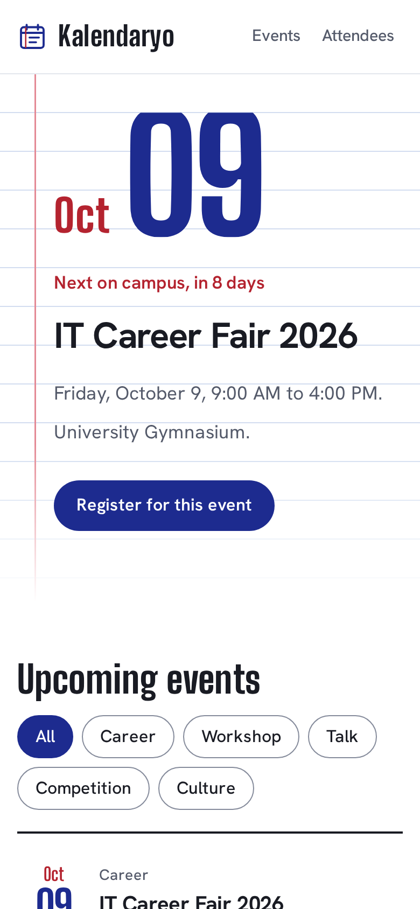
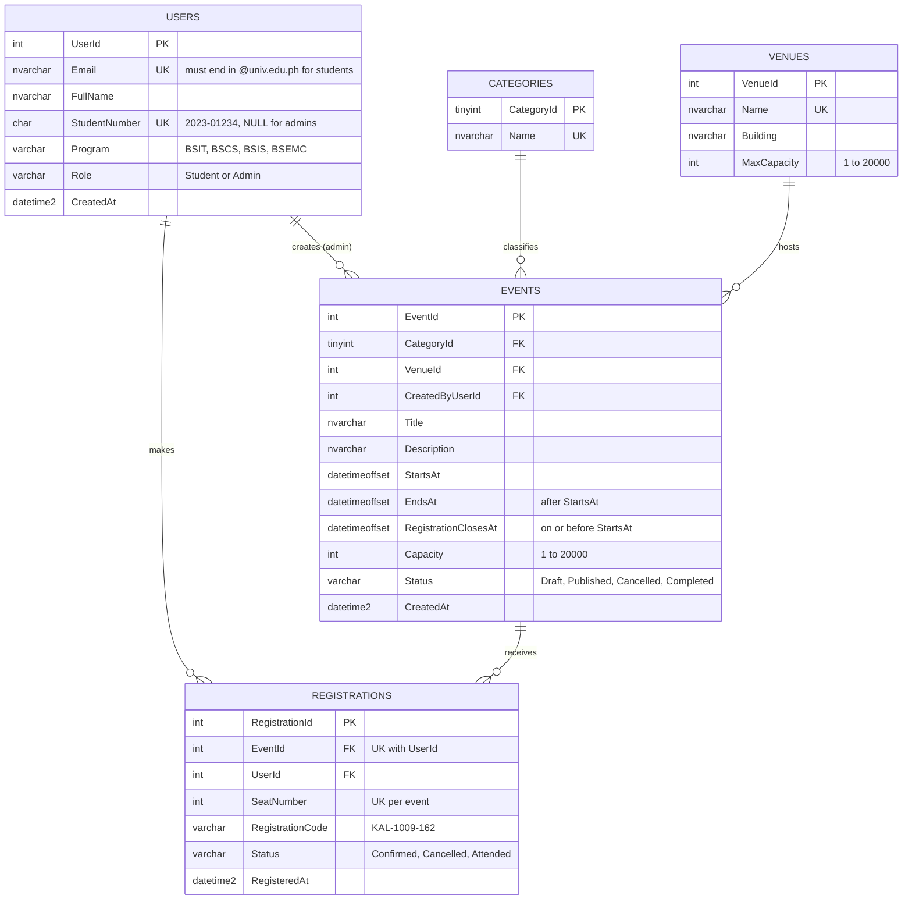

# Online Campus Event Management System — Group Laboratory Submission

**Course:** Applied Generative AI for IT Solution Development
**Prototype:** *Kalendaryo* (Filipino for "calendar") — browse campus events, register with a university email, and view attendees as an organizer.



```
/
├── SUBMISSION.md                  ← this report (Tasks 1–5)
├── README.md
├── package.json                   ← npm test / npm start shortcuts
├── frontend/                      ← Task 2: semantic, accessible UI (no frameworks)
│   ├── index.html
│   ├── css/styles.css
│   ├── js/validation.js           ← shared business rules (pure, testable)
│   ├── js/data.js                 ← prototype data matching the SQL schema
│   ├── js/app.js                  ← catalog, registration, attendee view
│   └── assets/                    ← SVG illustrations + self-hosted fonts (OFL)
├── database/                      ← Task 3
│   ├── schema.sql                 ← 3NF DDL: FKs, CHECKs, non-clustered FK indexes
│   ├── seed.sql
│   └── erd.mmd                    ← Mermaid ERD source
├── backend/                       ← Task 4
│   ├── RegistrationService.cs     ← refactored, injection-safe, disposes resources
│   └── Validation/                ← RegistrationValidator + repository interfaces
├── tests/                         ← Task 4
│   ├── EventManagement.Tests/     ← xUnit + Moq (C#)
│   └── frontend/validation.test.js← node:test + mock.fn (JavaScript)
└── docs/                          ← screenshots and rendered ERD
```

---

## Team Roster

| Member | Name | Assigned role | Primary responsibility |
|---|---|---|---|
| Member 1 | *[Full name]* | Systems Architect & Prompt Lead | Task 1 (Requirements & Prompt Engineering), Task 5 (Documentation & Integration) |
| Member 2 | *[Full name]* | Frontend Engineer | Task 2 (AI-Assisted UI & WCAG Accessibility) |
| Member 3 | *[Full name]* | Database & Backend Engineer | Task 3 (3NF Schema, Mermaid ERD, SQL Scripts) |
| Member 4 | *[Full name]* | QA & Security Engineer | Task 4 (Shift-Left Unit Testing & Vulnerability Refactoring) |

> Group of three: Member 1 and Member 3 split Task 4 (Member 1: unit tests, Member 3: security refactor).

---

## Task 1 — Requirements Analysis & Prompt Architecture

### 1.1 Production-grade prompt (Role–Context–Task–Constraints)

```text
ROLE
You are a Lead Systems Architect who designs small, teachable web systems for
university IT departments. You favour boring, proven technology and you are
honest about what a student team can finish.

CONTEXT
A team of 3–4 fourth-year BSIT students has a 3-hour laboratory exam to build a
working prototype of an "Online Campus Event Management System".
Functional scope:
  - Students view upcoming campus events.
  - Students register for an event using their university email (@univ.edu.ph).
  - Administrators view the registered attendees of an event.
Fixed stack for the exam:
  - Frontend: static HTML5, CSS and vanilla JavaScript in /frontend.
  - Database: Microsoft SQL Server, DDL in /database/schema.sql.
  - Backend: C# (.NET 8) classes in /backend; unit tests with xUnit and Moq.
The team is new to generative AI tools and will verify every AI output by hand.
Roles: Systems Architect, Frontend Engineer, Database & Backend Engineer, QA & Security Engineer.

TASK
Produce the overall system design for this prototype:
  1. A component overview and how data flows between frontend, backend and database.
  2. The core business rules for registration (email domain, seat availability,
     duplicates, closing time).
  3. A minimal REST API contract (method, path, purpose, who may call it).
  4. A data model outline (entities and key attributes only; the DBA will normalise it).
  5. A security baseline for the prototype.
  6. A repository folder structure and a time-boxed work split across the four roles
     that fits inside 180 minutes.
  7. Explicit assumptions and what is out of scope.

CONSTRAINTS
  - Do NOT use third-party state management libraries such as Redux, MobX or Zustand.
  - Do NOT use frontend frameworks or build tools (no React, Vue, Angular, Vite, Webpack).
  - Do NOT propose microservices, message queues, containers/Kubernetes or paid cloud services.
  - Do NOT design a real authentication system; describe the admin view as unprotected
    in the prototype and state how production would protect it.
  - Every database access you describe must use parameterised queries.
  - Keep the answer under 650 words. Use Markdown headings, and a table for the API contract.
  - If something cannot realistically be finished in 3 hours, say so instead of including it.
```

**RCTC checklist:** Persona ✔ (*Lead Systems Architect*) · Context ✔ (team, time box, stack, scope) · Task ✔ (seven numbered deliverables) · Constraints ✔ — negative constraints: *no Redux/third-party state management*, *no frameworks or build tools*, *no microservices/cloud*, *no real auth system*.

### 1.2 AI output (recorded verbatim)

> #### 1. Components and data flow
> - **Frontend (static):** `index.html` with three regions — event catalog, registration form, attendee list. State lives in plain JavaScript objects; the DOM is re-rendered from that state after each change.
> - **Validation module:** one pure function, `validateRegistration(input, deps)`, that receives its data sources as parameters. The same rules are implemented in C# (`RegistrationValidator`) so the server never trusts the browser.
> - **Backend (C#):** a thin service layer — `RegistrationValidator` for rules and `RegistrationService` for data access through `Microsoft.Data.SqlClient`.
> - **Database (SQL Server):** normalised tables plus one stored procedure that assigns seats inside a transaction.
>
> Flow: *Browser → POST /api/registrations → RegistrationValidator → usp_RegisterForEvent → Registrations table → 201 with registration code → browser shows ticket.*
>
> #### 2. Registration rules
> 1. Email must end exactly in `@univ.edu.ph` (reject look-alikes such as `@univ.edu.ph.evil.com`).
> 2. Student number format `YYYY-NNNNN`.
> 3. The event must be published and registration not yet closed.
> 4. Seats taken must be below capacity.
> 5. One registration per student per event.
>
> #### 3. API contract
> | Method | Path | Purpose | Caller |
> |---|---|---|---|
> | GET | `/api/events?upcoming=true` | Catalog with seats remaining | Anyone |
> | POST | `/api/registrations` | Register a student; returns code + seat | Student |
> | GET | `/api/registrations?email=` | Look up a student's registration | Student |
> | GET | `/api/events/{id}/attendees` | Attendee list | Admin |
>
> #### 4. Data model outline
> User (email, name, student number, role) · Event (title, schedule, venue, category, capacity, closing time, status) · Registration (user, event, seat, code, status, timestamp). Venue and Category are candidates for their own tables.
>
> #### 5. Security baseline
> Parameterised SQL only; connection string from configuration, never in code; `using` blocks for every connection/command; server-side validation mirrors client-side; unique constraint on (event, user); attendee view marked *unprotected prototype* — production puts it behind admin sign-in and role checks.
>
> #### 6. Folders and 180-minute plan
> `/frontend`, `/database`, `/backend`, `/tests`, `SUBMISSION.md`.
> | Minutes | Architect | Frontend | Database & Backend | QA & Security |
> |---|---|---|---|---|
> | 0–30 | This design, prompts | Wireframe, semantic skeleton | Entity list | Test plan |
> | 30–75 | Review UI prompts | Catalog + form | 3NF schema, ERD | Validator tests |
> | 75–120 | Integration | Accessibility pass | DDL, indexes | Refactor flawed method |
> | 120–165 | SUBMISSION.md | Fixes from review | Seed data | Run tests, verify |
> | 165–180 | Final check (all) | | | |
>
> #### 7. Assumptions and out of scope
> Assumed: a local SQL Server or Docker container is available; one time zone (Asia/Manila). **Not realistic in 3 hours:** hosting the four endpoints as a running ASP.NET Core API, authentication, email confirmations, payments, waitlists. For the demo, the frontend calls an in-browser repository that follows the same contract.

### 1.3 Manual grounding evaluation

The architecture is realistic for a 3-hour, four-person prototype only because the constraints cut it down to a static frontend, one normalised schema and two C# classes, and the AI itself flagged that hosting the four REST endpoints as a running API would not fit the time box. We verified this by mapping each component to the exam's 30/45/45/45/15-minute task blocks: every deliverable has exactly one owner and no task depends on infrastructure (CI, cloud hosting, auth) that would eat the session. The one risky assumption is that a SQL Server instance is already running on lab machines, which we could not guarantee, so we adopted the AI's own fallback and built the frontend on an in-browser repository (`frontend/js/app.js`) that follows the same API contract, keeping the demo working with no database. The data model, registration rules and security baseline were accurate when checked against the problem statement and became the direct inputs for Tasks 2–4.

---

## Task 2 — AI-Assisted Frontend Development

### 2.1 Prompt used

```text
ROLE: You are a senior front-end engineer and accessibility specialist.
CONTEXT: Online Campus Event Management System, 3-hour lab prototype. Students at a
Philippine university browse events and register with an @univ.edu.ph email;
organizers view attendees. Static HTML/CSS/vanilla JS only.
TASK: Build the Event Catalog & Registration Form (plus a simple attendee table) as
index.html + css/styles.css + js/app.js, with validation rules in a separate pure
module so they can be unit-tested.
DESIGN: Minimalist, light theme, but with one memorable moment. Concept: the page is a
sheet of Filipino "intermediate pad" paper — blue ruled lines, a red margin line,
blue ballpen ink for content, red ballpen ink for rules and warnings. On successful
registration, an admission ticket "prints" with a seat number, barcode and a red
REGISTERED stamp.
CONSTRAINTS:
- Use <header>, <nav>, <main>, <section>, <article>, <footer> instead of generic <div> wrappers.
- WCAG 2.2 AA (POUR): every input has a visible <label> AND an aria-label; images have
  meaningful alt text (decorative images use alt=""); text contrast ≥ 4.5:1 and
  UI-component contrast ≥ 3:1; visible focus; errors in text, not color alone;
  status messages in aria-live regions; respect prefers-reduced-motion.
- Do NOT use React, Vue, Tailwind, Bootstrap, jQuery or any state-management library.
- Must work when opened directly from disk (no build step, no ES-module imports).
```

### 2.2 What was built — `/frontend`

| Requirement | Where it is in the code |
|---|---|
| Semantic HTML5 | `<header class="site-header">`, `<nav aria-label="Primary">`, `<main id="main">`, `<section>` for hero, catalog, registration, attendees; each event is an `<article>` inside an ordered list (`<template id="event-template">`); the ticket is an `<article>` with its own `<header>`/`<footer>`; `<time datetime>` for dates; `<dl>` for ticket details; `<footer class="site-footer">`. |
| Event catalog | Sorted by date, filterable by category (toggle buttons using `aria-pressed`), seat meter, disabled "Full"/"Closed" states. |
| Registration form | Event, full name, student number, university email, program. Client-side validation via `js/validation.js`. |
| Admin view | Attendee table per event with search and CSV export (cells escaped against formula injection). |

**Design concept:** the hero is written on intermediate pad paper — the next event's date in tall blue-ballpen numerals, written in left-to-right on load (the page's only automatic animation). The seat meter shows twenty seats like a small lecture room. Registering prints an admission ticket that feeds out in steps, and a red **REGISTERED** stamp lands on it; at the same time the newly taken seat pops in the catalog and the new attendee is highlighted in the organizer table.



### 2.3 WCAG (POUR) accessibility features

| Principle | Feature | Implementation |
|---|---|---|
| **Perceivable** | Image alt text | Each event illustration has descriptive `alt` (e.g. *"Line drawing of a five-pointed star lantern with tassels"*). The header logo uses `alt=""` because the visible wordmark already names the site (WCAG technique H67). The barcode is `role="img"` with `aria-label="Barcode for registration code …"`. |
| | Color contrast | Body text 17.2:1, muted text 6.9:1, blue ink 11.7:1, red ink 6.5:1, placeholder 4.9:1, input borders 3.4:1 (SC 1.4.11). |
| | Not color alone | Errors are prefixed with ✕ and written out; full events say "Full, all 80 seats taken" in words. |
| **Operable** | Keyboard | Skip link, native buttons/selects only, visible 3 px focus ring, scrollable table region is focusable. 44 px minimum targets. |
| | Motion | All animation is disabled under `prefers-reduced-motion: reduce`. |
| **Understandable** | Labels | Every input has a visible `<label for>` **and** an `aria-label` that matches the visible text (SC 2.5.3 Label in Name), plus `aria-describedby` hints ("Must end in @univ.edu.ph."). |
| | Errors | `aria-invalid="true"` on bad fields, specific messages ("Enter your student number as 2023-01234."), focus moves to the first invalid field. |
| **Robust** | Status messages | `role="status"` / `aria-live="polite"` for form errors, success announcements, and attendee counts (SC 4.1.3). Table uses `<caption>`, `scope="col"` and `scope="row"`. Forced-colors (Windows High Contrast) styles included. |

**Automated check:** axe-core 4 (WCAG 2.0/2.1/2.2 A + AA + best practices) — **0 violations, 53 passes**, both on load and in the form-error state.



---

## Task 3 — Database Design & ERD Generation

### 3.1 Prompt used

```text
ROLE: You are a senior SQL Server database engineer.
CONTEXT: Online Campus Event Management System. Students (with @univ.edu.ph emails and
student numbers like 2023-01234) register for campus events; each event has a
category, a venue, a capacity and a registration closing time; admins create events
and view attendees.
TASK:
1. Design a schema in Third Normal Form with at least these entities: Users, Events,
   Registrations. Justify 1NF, 2NF and 3NF briefly.
2. Output the Entity-Relationship Diagram as Mermaid.js `erDiagram` code with PK/FK/UK markers.
3. Write a production-grade, re-runnable T-SQL DDL script for SQL Server 2016+.
CONSTRAINTS:
- Explicit FOREIGN KEY rules (ON DELETE / ON UPDATE) for every relationship; avoid
  multiple cascade paths.
- CHECK constraints for email domain, student number format, capacity, schedule order,
  and status values.
- A NONCLUSTERED index on every foreign key column (SQL Server does not create these).
- UNIQUE constraints that stop double registration and double-booked seats.
- Do not store derived or repeated data (no seats_remaining column, no venue name on Events).
- Name every constraint (PK_, FK_, UQ_, CK_, IX_).
```

### 3.2 Normalisation (3NF)

- **1NF** — every column is atomic (no comma-separated attendee lists); each table has a primary key.
- **2NF** — all keys are single-column surrogates, so there are no partial dependencies. The natural composite `(EventId, UserId)` on Registrations is enforced as `UNIQUE`, and every non-key column there depends on the whole registration.
- **3NF** — no transitive dependencies: a student's name, email and program live only in `Users` (not repeated on each registration); venue details live in `Venues` and category names in `Categories`, not on `Events`. Seats remaining is **derived** (`Capacity − COUNT(Registrations)`) and is therefore not stored.

### 3.3 Entity-Relationship Diagram (Mermaid.js)



(A rendered copy is in `docs/erd.png`; source in `database/erd.mmd`.)

### 3.4 DDL script — `/database/schema.sql`

**Foreign-key rules**

| Constraint | Rule | Reason |
|---|---|---|
| `FK_Registrations_Events` | `ON DELETE CASCADE` | Deleting an event removes its registrations. |
| `FK_Registrations_Users` | `ON DELETE CASCADE` | Deleting a user removes their registrations. |
| `FK_Events_CreatedBy` → Users | `ON DELETE NO ACTION` | A second cascade path Users → Events → Registrations would raise SQL Server error 1785. |
| `FK_Events_Categories`, `FK_Events_Venues` | `ON DELETE NO ACTION` | A category or venue cannot be deleted while events still use it. |

**CHECK constraints:** `CK_Users_Email` (single "@", no spaces, students must end in `@univ.edu.ph`), `CK_Users_StudentNumber` (`[12][0-9][0-9][0-9]-[0-9]{5}`), `CK_Users_StudentHasNumber`, `CK_Users_Role`, `CK_Users_Program`, `CK_Events_Schedule` (`EndsAt > StartsAt`), `CK_Events_Closes` (`RegistrationClosesAt <= StartsAt`), `CK_Events_Capacity`, `CK_Events_Status`, `CK_Registrations_Seat`, `CK_Registrations_Status`, `CK_Registrations_Code`, `CK_Venues_MaxCapacity`.

**Non-clustered indexes on foreign keys:** `IX_Events_CategoryId`, `IX_Events_VenueId`, `IX_Events_CreatedByUserId`, `IX_Registrations_EventId` (covering `UserId, Status, SeatNumber, RegisteredAt` for the attendee list and seat count), `IX_Registrations_UserId`. Plus `IX_Events_Status_StartsAt` for the catalog query and a filtered unique index `UX_Users_StudentNumber`.

**Integrity extras:** `UQ_Registrations_EventUser` (one seat per student per event), `UQ_Registrations_EventSeat` (no double-booked seats), view `vw_EventAttendees`, and `usp_RegisterForEvent`, which checks status, closing time, duplicates and capacity and assigns the seat inside one transaction with `UPDLOCK, HOLDLOCK` so two students cannot take the last seat at the same moment. `seed.sql` loads the sample events and registers students through that procedure.

---

## Task 4 — Shift-Left Testing, Security & Refactoring

### 4.1 Unit test generation

**Prompt used**

```text
ROLE: You are a QA engineer practising shift-left testing.
CONTEXT: RegistrationValidator (C#, .NET 8) validates a campus event registration. It
depends on IEventRepository, IRegistrationRepository and IClock. A JavaScript twin,
validateRegistration(input, deps), runs in the browser.
TASK: Write unit tests with xUnit and Moq (C#) and node:test with mock.fn (JS) for:
the @univ.edu.ph email domain rule (including look-alike and injection inputs), the
student number format, seat availability (last seat, full event), duplicate
registration, closing time (including the exact boundary), unpublished and missing
events.
CONSTRAINTS:
- Isolate every external dependency with a mock object; no database, file or real clock.
- Use MockBehavior.Strict and Verify / VerifyNoOtherCalls to prove that invalid input
  never reaches the repositories.
- One behaviour per test, Arrange–Act–Assert, descriptive names.
```

**Result** — `tests/EventManagement.Tests/RegistrationValidatorTests.cs`, `RegistrationServiceTests.cs`, `tests/frontend/validation.test.js`

How the mocks isolate dependencies:

- `Mock<IEventRepository>` and `Mock<IRegistrationRepository>` are **strict**: in `Validate_InvalidEmail_FailsWithoutTouchingAnyRepository` they have no setups, so any database call would throw, and `VerifyNoOtherCalls()` proves none happened.
- `Mock<IClock>` pins "now" to 1 October 2026 08:00 (+08:00), so closing-time tests are deterministic, including the exact-boundary case.
- `Validate_FullEvent_…` verifies `Exists(...)` is called `Times.Never` (no wasted query once the event is full); `Validate_DuplicateRegistration_…` verifies the repository receives the **normalised** email.

| Suite | Tests | Result |
|---|---|---|
| JavaScript (`npm test`, Node 22) | 33 | **33 passed, 0 failed** |
| C# (`dotnet test tests/EventManagement.Tests`) | 44 cases (17 test methods, theories expanded) | *Run on a machine with the .NET 8 SDK and paste the summary line here.* |

### 4.2 The flawed method (as given)

```csharp
// Flawed code: Contains SQL Injection and unmanaged resource leak
public string GetUserRegistration(string inputEmail) {
    string connStr = "Server=myServerAddress;Database=myDataBase;User Id=myUsername;Password=myPassword;";
    SqlConnection conn = new SqlConnection(connStr);
    conn.Open(); // Connection is not closed or disposed
    SqlCommand cmd = new SqlCommand("SELECT * FROM Registrations WHERE Email = '" + inputEmail + "'", conn);
    return cmd.ExecuteScalar().ToString();
}
```

### 4.3 AI diagnosis

**Prompt used**

```text
ROLE: You are an application security reviewer (OWASP Top 10, CWE).
TASK: Diagnose the C# method below for SQL injection risks and memory/resource leaks.
For each issue give: CWE id, severity, a concrete exploit or failure scenario, and the fix.
Then list any other defects you see. Do not rewrite the method yet.
<flawed method pasted here>
```

**AI output (recorded)**

| # | Issue | CWE | Severity | Scenario | Fix |
|---|---|---|---|---|---|
| 1 | **SQL injection** — `inputEmail` is concatenated into the SQL text. | CWE-89 | Critical | Input `' OR '1'='1` returns another student's registration; `x'; DROP TABLE Registrations; --` destroys data if the login has rights. | Parameterised query: `WHERE u.Email = @Email` with a typed `SqlParameter` (`NVarChar, 254`). |
| 2 | **Connection leak** — `SqlConnection` is opened and never closed or disposed. | CWE-404 / CWE-772 | High | Each call holds a pooled connection until garbage collection; under load the pool (default 100) is exhausted and requests time out. | `using` blocks for `SqlConnection` and `SqlCommand`, so `Dispose()` runs even when an exception is thrown. |
| 3 | `SqlCommand` not disposed. | CWE-404 | Medium | Unmanaged handles linger. | Same `using` block. |
| 4 | **Hard-coded credentials** in the connection string. | CWE-798 | High | Password ends up in Git history and every build artifact. | Inject the connection string from configuration / environment / user-secrets. |
| 5 | **Null dereference** — `ExecuteScalar()` returns `null` when no row matches, so `.ToString()` throws `NullReferenceException`. | CWE-476 | Medium | Any unregistered email crashes the request (500 error, possible stack-trace leak). | Check for `null`/`DBNull` and return `null`. |
| 6 | `SELECT *` with `ExecuteScalar` returns whichever column happens to be first. | — | Low | Result changes if the table's column order changes. | Select the one column needed. |
| 7 | No input validation. | CWE-20 | Low | Garbage input reaches the database. | Validate the email domain first (defence in depth, not a substitute for #1). |

**Team verification of the diagnosis:** we confirmed the injection by expanding the concatenated string for the payload `' OR '1'='1`, which becomes `WHERE Email = '' OR '1'='1'` and matches every row. We also checked the snippet against our Task 3 schema: it queries `Registrations.Email`, but in 3NF the email lives only on `Users`, so the refactored query joins `Users`.

### 4.4 Refactored solution — `/backend/RegistrationService.cs`

```csharp
public sealed class RegistrationService
{
    private const string LatestRegistrationByEmailSql = @"
SELECT TOP (1) r.RegistrationCode
FROM   dbo.Registrations AS r
INNER JOIN dbo.Users     AS u ON u.UserId = r.UserId
WHERE  u.Email = @Email
  AND  r.Status <> 'Cancelled'
ORDER BY r.RegisteredAt DESC;";

    private readonly string _connectionString;   // injected from configuration, never hard-coded

    public RegistrationService(string connectionString)
    {
        if (string.IsNullOrWhiteSpace(connectionString))
            throw new ArgumentException("A connection string is required.", nameof(connectionString));
        _connectionString = connectionString;
    }

    public string? GetUserRegistration(string inputEmail)
    {
        string email = RequireUniversityEmail(inputEmail);            // defence in depth

        using (var conn = new SqlConnection(_connectionString))       // disposed → returned to pool
        using (var cmd = new SqlCommand(LatestRegistrationByEmailSql, conn))
        {
            cmd.CommandType = CommandType.Text;
            cmd.CommandTimeout = 15;
            cmd.Parameters.Add("@Email", SqlDbType.NVarChar, 254).Value = email;   // parameterised

            conn.Open();
            object? result = cmd.ExecuteScalar();
            return result is null || result is DBNull ? null : Convert.ToString(result, CultureInfo.InvariantCulture);
        }   // cmd.Dispose() and conn.Dispose() run here, even if an exception is thrown
    }

    // GetUserRegistrationAsync(...) — same logic with `await using`, OpenAsync and ExecuteScalarAsync.
}
```

`RegistrationServiceTests` confirm that injection payloads (`' OR '1'='1`, `x'; DROP TABLE Registrations; --`) are rejected with `ArgumentException` **before** a connection is opened (the test connection string points at an unreachable server, so reaching `Open()` would fail the test).

---

## Task 5 — Group Integration & Verification Report

### 5.1 Team roster

See [Team Roster](#team-roster) at the top of this report.

### 5.2 Setup instructions

**Prerequisites:** a modern browser. Optional: Node.js 18+ (JavaScript tests), .NET 8 SDK (C# tests), SQL Server 2016+ or Docker (database).

1. **Get the code**
   ```bash
   git clone <your-group-repository-url>
   cd <repository-folder>
   ```
2. **Run the frontend** — open `frontend/index.html` directly in a browser (double-click works; fonts and images are local, no internet needed). To pin the demo date, append `?today=2026-10-01` to the URL. Or serve it:
   ```bash
   python -m http.server 5173 --directory frontend    # then open http://localhost:5173
   ```
   Registrations made in the browser are saved in that browser's `localStorage`; clear site data to reset.
3. **Create the database**
   ```bash
   # Optional: SQL Server in Docker
   docker run -e "ACCEPT_EULA=Y" -e "MSSQL_SA_PASSWORD=<StrongPassw0rd!>" -p 1433:1433 -d mcr.microsoft.com/mssql/server:2022-latest

   sqlcmd -S localhost -U sa -P "<StrongPassw0rd!>" -C -i database/schema.sql
   sqlcmd -S localhost -U sa -P "<StrongPassw0rd!>" -C -i database/seed.sql
   ```
   Or open both scripts in SSMS / Azure Data Studio and execute `schema.sql` first, then `seed.sql`.
4. **Run the tests**
   ```bash
   npm test                                   # JavaScript validator tests (no install needed)
   dotnet test tests/EventManagement.Tests    # C# xUnit + Moq tests (restores NuGet packages)
   ```
5. **Use the backend service against the database** — set the connection string as an environment variable (never commit it):
   ```bash
   export CAMPUS_EVENTS_DB="Server=localhost;Database=CampusEvents;User Id=sa;Password=<StrongPassw0rd!>;TrustServerCertificate=True"
   ```
   then construct `RegistrationService.FromEnvironment()`.

### 5.3 AI disclosure statement

We used generative AI during this examination as follows:

| Tool | Used for | How the output was verified |
|---|---|---|
| **Claude (Anthropic)** | Task 1 architecture output; first drafts of the frontend (HTML/CSS/JS), the 3NF schema, Mermaid ERD and DDL, the unit tests, and the security diagnosis/refactor; drafting this report. | Every artifact was opened, run or executed: the UI was reviewed in desktop and mobile browsers and screenshotted; accessibility was checked with axe-core (0 violations) plus manual keyboard and screen-reader-label review; contrast ratios were computed; the JavaScript test suite was executed (33/33 passing); the Mermaid ERD was rendered to confirm it parses; the SQL batches were parsed and reviewed constraint by constraint against the 3NF rules; the refactored C# was reviewed line by line against the CWE list in 4.3. |
| *[Add any other tool your group used, e.g. GitHub Copilot, v0, ChatGPT]* | | |

All AI output was treated as a draft. The team is responsible for the final code, and the corrections we made are logged below.

### 5.4 Group verification log

| Task # | Identified AI flaw / limitation | Manual correction applied | Member responsible |
|---|---|---|---|
| Task 2 | The success message was written into a live region **inside** the form, and the form is hidden on success, so screen readers never announced the registration. | Added a separate `role="status"` announcer outside the form for the success message. | Member 2 |
| Task 2 | The `hidden` attribute did nothing on the form because `.form { display: grid }` overrode it; the form and the ticket showed at the same time. | Added a global `[hidden] { display: none !important; }` rule. | Member 2 |
| Task 2 | axe-core flagged `landmark-unique`: the attendee section and the table's scroll region shared the same accessible name. | Relabelled the table region with the table caption ("Registered attendees for …"). | Member 2 |
| Task 2 | Fonts loaded from Google Fonts with a preload that fails over `file://`, so the page showed fallback fonts offline and logged CORS errors. | Self-hosted the two OFL-licensed fonts in `frontend/assets/fonts` and removed the preload. | Member 2 |
| Task 2 | The hero countdown used 24-hour blocks (`Math.ceil`) and said "in 9 days" for an event 8 calendar days away. | Counted whole calendar days in the Asia/Manila time zone. | Member 2 |
| Task 3 | Registration code used `RIGHT('000' + seat, 3)`, which turns seat 1000 into `000`, and a global `UNIQUE` on the code would collide for two events on the same date. | Switched to `FORMAT(@SeatNumber, '000')` (pads without truncating) and made the code unique per event: `UQ_Registrations_EventCode (EventId, RegistrationCode)`. | Member 3 |
| Task 2 | Generated sample attendees had seat numbers out of order with their sign-up times (seat 7 registered after seat 159), which made the organizer table look wrong. | Sign-up times are generated first and sorted, so seat 1 is always the earliest registration. | Member 2 |
| Task 4 | The suggested test command `node --test tests/frontend` fails on Node 22 ("Cannot find module"): newer Node treats a bare directory argument as a file. | `npm test` now runs `node --test tests/frontend/validation.test.js`; all 33 tests pass. | Member 4 |
| Task 4 | `TreatWarningsAsErrors` in the backend project would turn NuGet security-audit warnings on transitive packages into build failures on the grader's machine. | Removed the flag from `EventManagement.Backend.csproj`; warnings still show, but the build and `dotnet test` are not blocked. | Member 4 |

> Each row above must be confirmed by the member named before submission: re-check the change in the code and edit the wording if your group's experience differed.
